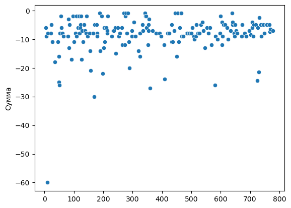
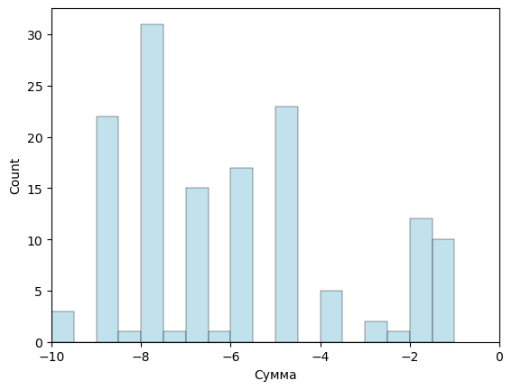
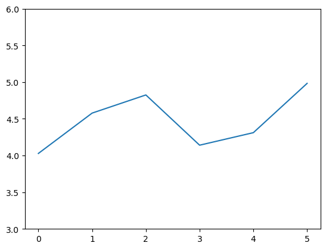

## Plan

- DONE import expenses
- compute static monthly avg home meal price = food / N where N = ( 30 * 3 - [takeaway+resto above 4 eur treshold])
- Treshold: > or <= 4 EUR
- plot takeaway and resto expenses to see where to draw the line

Further:

- compute home meal price by resizible rolling window - from quarter to 1 week
- plot a seaborn graph showing dynamics: is the price increased? by how much?


```python
import pandas as pd
import seaborn as sns
import matplotlib.pyplot as plt
import numpy as np
```


```python
filepath = "./input/MoneyOK.csv"
expenses = pd.read_csv(filepath, sep="\t")
expenses.shape
```


    (782, 7)


```python
away = expenses[(expenses["Статья"] == "Resto") | (expenses["Статья"] == "Takeaway")]

```


```python
sns.scatterplot(x=away.index, y=away["Сумма"])
```


    <AxesSubplot: ylabel='Сумма'>





```python
sns.histplot(away["Сумма"], color='lightblue', binwidth=0.5)
plt.xlim(-10, 0)
```


    (-10.0, 0.0)


​    

​    


```python
expenses
```


<div>
<style scoped>
    .dataframe tbody tr th:only-of-type {
        vertical-align: middle;
    }

    .dataframe tbody tr th {
        vertical-align: top;
    }
    
    .dataframe thead th {
        text-align: right;
    }
</style>
<table border="1" class="dataframe">
  <thead>
    <tr style="text-align: right;">
      <th></th>
      <th>Дата</th>
      <th>Сумма</th>
      <th>Валюта</th>
      <th>Счет</th>
      <th>Статья</th>
      <th>Группа статей</th>
      <th>Комментарий</th>
    </tr>
  </thead>
  <tbody>
    <tr>
      <th>0</th>
      <td>2022.11.03</td>
      <td>-60.0</td>
      <td>NaN</td>
      <td>Мои деньги</td>
      <td>Telecom</td>
      <td>NaN</td>
      <td>VPN Mullvad 1 year</td>
    </tr>
    <tr>
      <th>1</th>
      <td>2022.11.03</td>
      <td>-17.0</td>
      <td>NaN</td>
      <td>Мои деньги</td>
      <td>Other</td>
      <td>NaN</td>
      <td>LinkedIn premium 50% off two months</td>
    </tr>
    <tr>
      <th>2</th>
      <td>2022.11.03</td>
      <td>-1.0</td>
      <td>NaN</td>
      <td>Мои деньги</td>
      <td>Café</td>
      <td>Eat</td>
      <td>NaN</td>
    </tr>
    <tr>
      <th>3</th>
      <td>2022.11.03</td>
      <td>-58.0</td>
      <td>NaN</td>
      <td>Мои деньги</td>
      <td>Therapy</td>
      <td>NaN</td>
      <td>Rub card Tinkoff</td>
    </tr>
    <tr>
      <th>4</th>
      <td>2022.11.03</td>
      <td>-1.0</td>
      <td>NaN</td>
      <td>Мои деньги</td>
      <td>Café</td>
      <td>Eat</td>
      <td>NaN</td>
    </tr>
    <tr>
      <th>...</th>
      <td>...</td>
      <td>...</td>
      <td>...</td>
      <td>...</td>
      <td>...</td>
      <td>...</td>
      <td>...</td>
    </tr>
    <tr>
      <th>777</th>
      <td>2022.04.25</td>
      <td>-5.0</td>
      <td>NaN</td>
      <td>Мои деньги</td>
      <td>Fun</td>
      <td>NaN</td>
      <td>NaN</td>
    </tr>
    <tr>
      <th>778</th>
      <td>2022.04.25</td>
      <td>-7.0</td>
      <td>NaN</td>
      <td>Мои деньги</td>
      <td>Takeaway</td>
      <td>Eat</td>
      <td>NaN</td>
    </tr>
    <tr>
      <th>779</th>
      <td>2022.04.25</td>
      <td>-14.0</td>
      <td>NaN</td>
      <td>Мои деньги</td>
      <td>Health</td>
      <td>NaN</td>
      <td>Liquid contact lenses</td>
    </tr>
    <tr>
      <th>780</th>
      <td>2022.04.24</td>
      <td>-21.0</td>
      <td>NaN</td>
      <td>Мои деньги</td>
      <td>Taxi</td>
      <td>Go</td>
      <td>NaN</td>
    </tr>
    <tr>
      <th>781</th>
      <td>2022.04.23</td>
      <td>-10.0</td>
      <td>NaN</td>
      <td>Мои деньги</td>
      <td>Telecom</td>
      <td>NaN</td>
      <td>NaN</td>
    </tr>
  </tbody>
</table>
<p>782 rows × 7 columns</p>
</div>


## Data cleaning


```python
# date column to switch to date type
expenses['Дата'] = pd.to_datetime(expenses['Дата'], format='%Y.%m.%d')
expenses.dtypes
```


    Дата             datetime64[ns]
    Сумма                   float64
    Валюта                  float64
    Счет                     object
    Статья                   object
    Группа статей            object
    Комментарий              object
    dtype: object


```python
# make expenses positive
expenses['Сумма'] = expenses['Сумма'] * (-1)
expenses
```


<div>
<style scoped>
    .dataframe tbody tr th:only-of-type {
        vertical-align: middle;
    }

    .dataframe tbody tr th {
        vertical-align: top;
    }
    
    .dataframe thead th {
        text-align: right;
    }
</style>
<table border="1" class="dataframe">
  <thead>
    <tr style="text-align: right;">
      <th></th>
      <th>Дата</th>
      <th>Сумма</th>
      <th>Валюта</th>
      <th>Счет</th>
      <th>Статья</th>
      <th>Группа статей</th>
      <th>Комментарий</th>
    </tr>
  </thead>
  <tbody>
    <tr>
      <th>0</th>
      <td>2022-11-03</td>
      <td>60.0</td>
      <td>NaN</td>
      <td>Мои деньги</td>
      <td>Telecom</td>
      <td>NaN</td>
      <td>VPN Mullvad 1 year</td>
    </tr>
    <tr>
      <th>1</th>
      <td>2022-11-03</td>
      <td>17.0</td>
      <td>NaN</td>
      <td>Мои деньги</td>
      <td>Other</td>
      <td>NaN</td>
      <td>LinkedIn premium 50% off two months</td>
    </tr>
    <tr>
      <th>2</th>
      <td>2022-11-03</td>
      <td>1.0</td>
      <td>NaN</td>
      <td>Мои деньги</td>
      <td>Café</td>
      <td>Eat</td>
      <td>NaN</td>
    </tr>
    <tr>
      <th>3</th>
      <td>2022-11-03</td>
      <td>58.0</td>
      <td>NaN</td>
      <td>Мои деньги</td>
      <td>Therapy</td>
      <td>NaN</td>
      <td>Rub card Tinkoff</td>
    </tr>
    <tr>
      <th>4</th>
      <td>2022-11-03</td>
      <td>1.0</td>
      <td>NaN</td>
      <td>Мои деньги</td>
      <td>Café</td>
      <td>Eat</td>
      <td>NaN</td>
    </tr>
    <tr>
      <th>...</th>
      <td>...</td>
      <td>...</td>
      <td>...</td>
      <td>...</td>
      <td>...</td>
      <td>...</td>
      <td>...</td>
    </tr>
    <tr>
      <th>777</th>
      <td>2022-04-25</td>
      <td>5.0</td>
      <td>NaN</td>
      <td>Мои деньги</td>
      <td>Fun</td>
      <td>NaN</td>
      <td>NaN</td>
    </tr>
    <tr>
      <th>778</th>
      <td>2022-04-25</td>
      <td>7.0</td>
      <td>NaN</td>
      <td>Мои деньги</td>
      <td>Takeaway</td>
      <td>Eat</td>
      <td>NaN</td>
    </tr>
    <tr>
      <th>779</th>
      <td>2022-04-25</td>
      <td>14.0</td>
      <td>NaN</td>
      <td>Мои деньги</td>
      <td>Health</td>
      <td>NaN</td>
      <td>Liquid contact lenses</td>
    </tr>
    <tr>
      <th>780</th>
      <td>2022-04-24</td>
      <td>21.0</td>
      <td>NaN</td>
      <td>Мои деньги</td>
      <td>Taxi</td>
      <td>Go</td>
      <td>NaN</td>
    </tr>
    <tr>
      <th>781</th>
      <td>2022-04-23</td>
      <td>10.0</td>
      <td>NaN</td>
      <td>Мои деньги</td>
      <td>Telecom</td>
      <td>NaN</td>
      <td>NaN</td>
    </tr>
  </tbody>
</table>
<p>782 rows × 7 columns</p>
</div>


### One time calc
avg home meal price = food / N where N = ( 30 * 3 - [takeaway+resto above 4 eur treshold])


```python
food = sum(expenses[expenses["Статья"] == "Food"]["Сумма"])
food
```


    1842.8100000000002


```python
takeaway = sum(expenses[(expenses["Статья"].isin(["Takeaway", "Resto"])) & (expenses["Сумма"] > 4)]["Сумма"])
takeaway_count = expenses[(expenses["Статья"].isin(["Takeaway", "Resto"])) & (expenses["Сумма"] > 4)].shape[0]
```


```python
print(food, takeaway, takeaway_count)
```

    1842.8100000000002 1514.5 154


```python
# alt period compute from web
(expenses["Дата"].max() - expenses["Дата"].min()) / np.timedelta64(1, 'D')
```


    194.0


```python
# compute period in days
days = (expenses["Дата"].max() - expenses["Дата"].min()).days
days
```


    194


```python
expenses["Дата"]
```


    0     2022-11-03
    1     2022-11-03
    2     2022-11-03
    3     2022-11-03
    4     2022-11-03
             ...    
    777   2022-04-25
    778   2022-04-25
    779   2022-04-25
    780   2022-04-24
    781   2022-04-23
    Name: Дата, Length: 782, dtype: datetime64[ns]


```python
food_times = days * 3
home_meal_times = food_times - takeaway_count
home_meal_times
```


    428


```python
food / home_meal_times
```


    4.305630841121496


```python
def avg_meal_price(expenses):
    food = sum(expenses[expenses["Статья"] == "Food"]["Сумма"])
    takeaway_count = expenses[(expenses["Статья"].isin(["Takeaway", "Resto"])) & (expenses["Сумма"] > 4)].shape[0]
    
    days = (expenses["Дата"].max() - expenses["Дата"].min()).days
    home_meal_times = days * 3 - takeaway_count
    
    return food / home_meal_times
```


```python
avg_meal_price(expenses)
```


    4.305630841121496


## Periodic calc


```python
windowsize_days = 30
all_days = (expenses["Дата"].max() - expenses["Дата"].min()).days
periods = all_days // windowsize_days

list_prices = []

for i in range(periods):
    expenses_subset = expenses[
        ( expenses["Дата"] >= (expenses["Дата"].min() + pd.Timedelta(days = windowsize_days * i)) ) &
        ( expenses["Дата"] < (expenses["Дата"].min() + pd.Timedelta(days = windowsize_days * (i+1))) )]
    list_prices.append(avg_meal_price(expenses_subset))
    
list_prices

```


    [4.02828125,
     4.578125,
     4.825396825396825,
     4.140845070422535,
     4.311475409836065,
     4.983050847457627]


```python
sns.lineplot(list_prices).set_ylim(3,6)
```


    (3.0, 6.0)


​    

​    


```python
# TODO: add Y axis labels as dates 
```

## Visualisation


```python
a = expenses.iloc[90:120,]
avg_meal_price(a)
```


    4.388888888888889


```python
for i in range(periods):
    print(windowsize_days*i, windowsize_days*(i+1))
```

    0 14
    14 28
    28 42
    42 56
    56 70
    70 84
    84 98
    98 112
    112 126
    126 140
    140 154
    154 168
    168 182


```python
range(periods)
```


    range(0, 13)


```python
expenses.iloc[140:154,]
```


<div>
<style scoped>
    .dataframe tbody tr th:only-of-type {
        vertical-align: middle;
    }

    .dataframe tbody tr th {
        vertical-align: top;
    }
    
    .dataframe thead th {
        text-align: right;
    }
</style>
<table border="1" class="dataframe">
  <thead>
    <tr style="text-align: right;">
      <th></th>
      <th>Дата</th>
      <th>Сумма</th>
      <th>Валюта</th>
      <th>Счет</th>
      <th>Статья</th>
      <th>Группа статей</th>
      <th>Комментарий</th>
    </tr>
  </thead>
  <tbody>
    <tr>
      <th>140</th>
      <td>2022-09-28</td>
      <td>42.0</td>
      <td>NaN</td>
      <td>Мои деньги</td>
      <td>Food</td>
      <td>Eat</td>
      <td>NaN</td>
    </tr>
    <tr>
      <th>141</th>
      <td>2022-09-28</td>
      <td>1.0</td>
      <td>NaN</td>
      <td>Мои деньги</td>
      <td>Café</td>
      <td>Eat</td>
      <td>NaN</td>
    </tr>
    <tr>
      <th>142</th>
      <td>2022-09-27</td>
      <td>8.0</td>
      <td>NaN</td>
      <td>Мои деньги</td>
      <td>Takeaway</td>
      <td>Eat</td>
      <td>NaN</td>
    </tr>
    <tr>
      <th>143</th>
      <td>2022-09-27</td>
      <td>2.0</td>
      <td>NaN</td>
      <td>Мои деньги</td>
      <td>Takeaway</td>
      <td>Eat</td>
      <td>NaN</td>
    </tr>
    <tr>
      <th>144</th>
      <td>2022-09-27</td>
      <td>15.0</td>
      <td>NaN</td>
      <td>Мои деньги</td>
      <td>Food</td>
      <td>Eat</td>
      <td>NaN</td>
    </tr>
    <tr>
      <th>145</th>
      <td>2022-09-27</td>
      <td>13.0</td>
      <td>NaN</td>
      <td>Мои деньги</td>
      <td>Transpo</td>
      <td>Go</td>
      <td>NaN</td>
    </tr>
    <tr>
      <th>146</th>
      <td>2022-09-27</td>
      <td>3.0</td>
      <td>NaN</td>
      <td>Мои деньги</td>
      <td>Café</td>
      <td>Eat</td>
      <td>NaN</td>
    </tr>
    <tr>
      <th>147</th>
      <td>2022-09-27</td>
      <td>9.0</td>
      <td>NaN</td>
      <td>Мои деньги</td>
      <td>Resto</td>
      <td>Eat</td>
      <td>NaN</td>
    </tr>
    <tr>
      <th>148</th>
      <td>2022-09-27</td>
      <td>5.0</td>
      <td>NaN</td>
      <td>Мои деньги</td>
      <td>Taxi</td>
      <td>Go</td>
      <td>NaN</td>
    </tr>
    <tr>
      <th>149</th>
      <td>2022-09-27</td>
      <td>8.0</td>
      <td>NaN</td>
      <td>Мои деньги</td>
      <td>Other</td>
      <td>NaN</td>
      <td>NaN</td>
    </tr>
    <tr>
      <th>150</th>
      <td>2022-09-27</td>
      <td>4.0</td>
      <td>NaN</td>
      <td>Мои деньги</td>
      <td>Tabac</td>
      <td>NaN</td>
      <td>NaN</td>
    </tr>
    <tr>
      <th>151</th>
      <td>2022-09-26</td>
      <td>1.0</td>
      <td>NaN</td>
      <td>Мои деньги</td>
      <td>Fun</td>
      <td>NaN</td>
      <td>NaN</td>
    </tr>
    <tr>
      <th>152</th>
      <td>2022-09-26</td>
      <td>10.0</td>
      <td>NaN</td>
      <td>Мои деньги</td>
      <td>Telecom</td>
      <td>NaN</td>
      <td>NaN</td>
    </tr>
    <tr>
      <th>153</th>
      <td>2022-09-26</td>
      <td>8.0</td>
      <td>NaN</td>
      <td>Мои деньги</td>
      <td>Resto</td>
      <td>Eat</td>
      <td>NaN</td>
    </tr>
  </tbody>
</table>
</div>


```python

```
